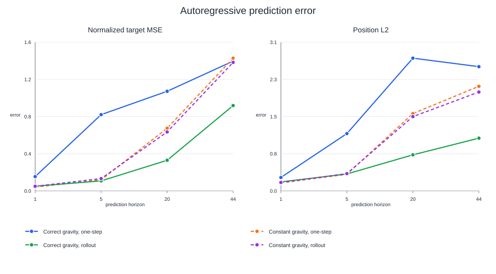
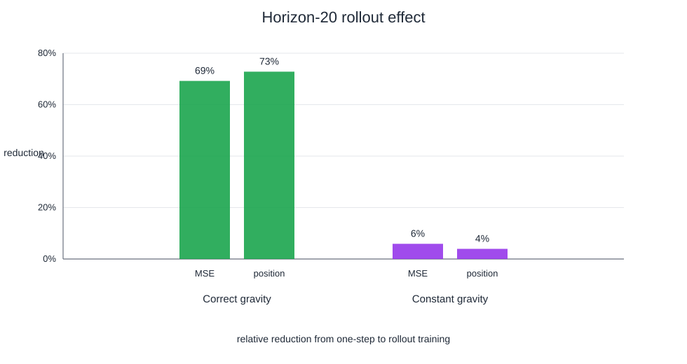

# Gravity conditioning and rollout training in SG-JEPA

This repository contains the runnable SG-JEPA code, the four-cell factorial
experiment, the analysis data, and the figures for the result.

The experiment asks one question: does SG-JEPA benefit from receiving gravity,
from training on multi-step rollouts, or from the combination?

## Result

In this setup, gravity conditioning did not help under one-step training. It
helped when rollout training made the physical parameter useful for repeated
prediction.



At horizon 20, rollout training reduced normalized target MSE by 69% and
position error by 73% with the correct gravity input. With constant gravity,
the same change reduced those errors by 6% and 4%.



The result supports a narrow conclusion. A physical parameter can be present
in the action input without shaping the representation. Repeated prediction
creates pressure to preserve the parameter when it changes the dynamics.

## Factorial design

All cells use the same ViT-Tiny encoder, GRU predictor, optimizer, data split,
and 20-epoch schedule.

| Cell | Gravity input | World-model objective |
| --- | --- | --- |
| `correct_onestep` | True normalized episode gravity | One-step prediction |
| `constant_onestep` | Normalized training mean, `0` | One-step prediction |
| `correct_rollout` | True normalized episode gravity | Five-step autoregressive rollout |
| `constant_rollout` | Normalized training mean, `0` | Five-step autoregressive rollout |

Each cell has one world-model training seed, `42`. Each checkpoint has five
probe and evaluation seeds, `42` through `46`. The rollout cells replace the
one-step objective. They set `prediction_weight: 0.0` and
`rollout_weight: 1.0`, so this run does not test an additive rollout loss.

## Evaluation

The figures use the means across five evaluation seeds and 5,000 episodes from
one fixed test manifest. Lower is better.

| Horizon | Correct, one-step | Constant, one-step | Correct, rollout | Constant, rollout |
| ---: | ---: | ---: | ---: | ---: |
| 1 | 0.155 / 0.277 | 0.041 / 0.164 | 0.051 / 0.186 | 0.050 / 0.174 |
| 5 | 0.824 / 1.180 | 0.120 / 0.342 | 0.108 / 0.349 | 0.133 / 0.356 |
| 20 | 1.076 / 2.734 | 0.677 / 1.593 | 0.331 / 0.743 | 0.637 / 1.530 |
| 44 | 1.402 / 2.559 | 1.434 / 2.154 | 0.922 / 1.086 | 1.388 / 2.036 |

Each entry is `normalized target MSE / position L2`.

The evaluation compares free autoregressive predictions with an oracle probe
baseline. The oracle rows use ground-truth trajectories. They are not
teacher-forced model predictions.

## Interpretation

A one-step objective can fit local transitions while ignoring gravity. The
visual history already exposes much of the current state, so the predictor can
use an average local change.

Rollout training changes the failure mode. The predictor feeds its own latent
back into the next step. If it ignores gravity while gravity changes the
dynamics, error compounds across the rollout. Constant gravity does not expose
a family of dynamics, so it cannot teach the model to use gravity to distinguish
those regimes.

This result agrees with the mechanism proposed by
[Semigroup-JEPA](https://arxiv.org/abs/2609.10464). The paper reports a small
teacher-forced gap, a larger free-rollout gap, and higher rollout error under
incorrect gravity. Those results do not isolate the two factors. This
experiment does.

## Limits and follow-ups

- Each cell has one world-model training seed. The five downstream seeds do not
  measure training variance.
- The rollout objective replaces the one-step objective. An additive-loss
  ablation remains open.
- The task uses one simulated environment and one scalar physical parameter.
- The evaluation still needs a teacher-forced model-prediction comparison.

Useful follow-ups are true, zeroed, shuffled, and wrong-gravity evaluation;
teacher-forced prediction; additive one-step plus rollout loss; and multiple
world-model training seeds.

## Reproduce

The repository includes the upstream SG-JEPA source with the experiment
changes applied. The experiment entrypoints are in
`experiments/gravity_rollout_factorial/`.

Install the upstream environment, generate a Square dataset, and set these
paths to locations available on your machine:

```bash
uv sync --extra data --extra hub
export SGJEPA_ROOT="$PWD"
export SGJEPA_PYTHON="$SGJEPA_ROOT/.venv-paper/bin/python"
export SGJEPA_DATASET="/path/to/square-dataset"
export SGJEPA_OUTPUT="/path/to/experiment-output"
```

Generate and verify the dataset:

```bash
"$SGJEPA_PYTHON" -m data_generation.generate \
  --recipe data_generation/recipes/main_text.yaml \
  --task square \
  --split all \
  --output "$SGJEPA_DATASET"
"$SGJEPA_PYTHON" scripts/verify_examples.py data \
  --path "$SGJEPA_DATASET" \
  --task square \
  --episodes 48000 \
  --train-episodes 8000 \
  --test-episodes 40000
```

The Slurm job files keep site-specific settings out of the repository. Use
`experiments/gravity_rollout_factorial/slurm/submit.sh` to pass your partition,
QoS, and GPU resource through environment variables.

The committed `upstream.patch` records the experiment diff against the
official SG-JEPA release. You do not need to apply it to run this checkout.

## Repository layout

- `sg_jepa/`, `train.py`, and the surrounding files are the runnable SG-JEPA
  source.
- `configs/train/square_factorial_*.yaml` define the four factorial cells.
- `experiments/gravity_rollout_factorial/slurm/` contains data, training,
  probe, evaluation, and generic submission entrypoints.
- `analysis/results.csv` contains the plotted summary values.
- `analysis/plot_results.py` regenerates the figures.
- `figures/` contains the SVG figures embedded above, plus PDF and PNG exports.
- `upstream.patch` records the experiment changes relative to the upstream
  source.

The upstream source is [sg-jepa/sg-jepa](https://github.com/sg-jepa/sg-jepa).
Its license and third-party notices remain in this repository.
